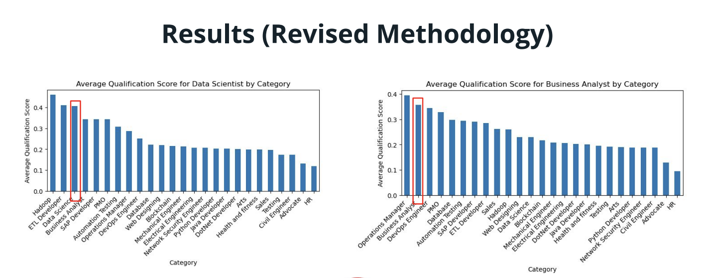

### Overview
This readme file is an executive summary of the problem statement, data dictionary, datasets used, methodology, and the conclusions/recommendations from this analysis.

---

### Problem Statement

Workforce Singapore manages a job matching portal (MyCareerFuture), which serves employers and jobseekers alike. Employers complain that the applicants on the portal are not qualified for the jobs they are posting for. However, they are not able to justify what they mean by “qualified”.

This project aims to quantify the suitability of jobseekers to recommend the most “qualified” candidates to employers, and identify the gaps in quality of the candidates to recommend employers to focus their efforts on training post-hiring.

---

### Data Dictionary

| Key Feature | Type | Description | 
| --- | --- | --- | 
| `category` | String | Industry of current/last held job |
| `resume` | String | Resumes of jobseekers |
| `Job Description` | String | Job descriptions |

### Datasets

There are 3 datasets included in the [`data`](./data/) folder for this project. These correponds to rainfall and traffic accident information. 

* [`cv_data.csv`](./data/cv_data.csv): Cleaned list of resumes from 25 categories.
* [`jd_ds.csv`](./data/jd_ds.csv): Cleaned list of job descriptions for Data Scientist.
* [`jd_ba.csv`](./data/jd_ba.csv): Cleaned list of job descriptions for Business Analyst.

---

### Exploratory Data Analysis

Key findings from EDA:
- The key words from resumes in Data Science and Business Analyst are relevant.
- The key words from job descriptions in Data Science and Business Analyst are relatively generic, mainly due to inclusions of company descriptions which may not be related to the job.
- The median string length of the resumes are similar to the job descriptions, which is contrary to expectations as resumes consists of experience across multiple roles, so should be longer.

---

### Preprocessing

In this section, we will be preprocessing our data so that we can build our model with clean data. We will try to remove urls, stopwords, quotation marks, emoticons, and other content in the resumes and job descriptions that are either noise, or not useful for building our model.

After cleaning the data, we will tokenize and lemmatize to reduce each word to its base form. This will allow us to remove overlapping words and reduce the number of unique tokens to be used for our model.

---

### Methodology

In this section we will build models using Latent Dirichlet Allocation (LDA) techniques.

We will adopt the following approach in our model building:

Rationale behind approach:
Rather than creating cosine similarity scores based on topics generating, we create the scores using the tokenized words instead, as the generated topics may not be relevant or accurate.

Also, we decided to train the LDA models using the job descriptions, and apply the trained models to the resumes to derive probabilities for the topics related to the job roles.

---

### Model Evaluation

As this is an unsupervised learning technique, we are unable to validate the performance of the model. However, we can hypothesize that resumes from the same category as the job roles should score more highly compared to other categories, as seen below.

---

### Conclusion

#### Limitations/Enhancements for future work

Firstly, the suitability score is based on tokenized words and does not consider the recency of relevant experience. so it can be something that was done 10 years ago but will still push up the score as it matches what was written in the job description. For ruture work, we will explore assigning higher weightage to the most recent work experience.

Secondly, topic modeling using LDA just considers word frequencies but not the order of words and the context, which can lead to irrelevant topics. For future work, we can explore using a pre-trained model called RoBERTa to identify the topics, as it is said to be able to capture more complex language patterns by looking at full sentence embeddings.

Lastly, after modeling the topics, we still need to manually assess the bag of words to identify what is the topic about before we can recommend to the employers. Hence for future work, we can try to map to the skills and competencies under skillsfuture framework using fuzzy matching, so that we can auto label the skills that the candidates needs more training.

---

